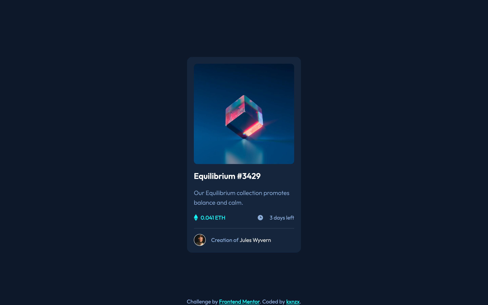
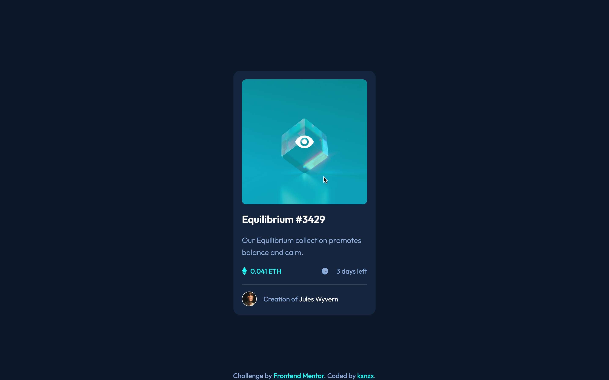
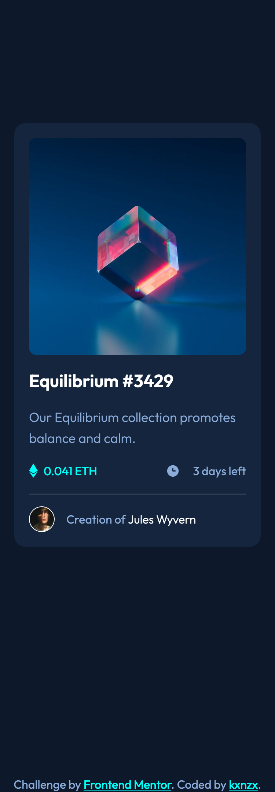

# Frontend Mentor - NFT Preview Card Component Solution

This is a solution to the [NFT Preview Card Component Challenge on Frontend Mentor](https://www.frontendmentor.io/challenges/nft-preview-card-component-SbdUL_w0U). Frontend Mentor challenges help you improve your coding skills by building realistic projects.

## Table of contents

- [Overview](#overview)
  - [The challenge](#the-challenge)
  - [Screenshot](#screenshot)
  - [Links](#links)
- [My process](#my-process)
  - [Built with](#built-with)
  - [What I learned](#what-i-learned)
  - [Useful resources](#useful-resources)
- [Author](#author)

## Overview

### The challenge

Users should be able to:

- View the optimal layout depending on their device's screen size
- See hover states for interactive elements

### Screenshot

#### Screensize 1440px - Desktop



#### Screensize 1440px - Card Hover State



#### Screensize 375px - Mobile



### Links

- View my Solution on [Frontend Mentor](https://your-solution-url.com)
- View the Live Site [here](https://your-live-site-url.com)

## My process

- HTML semantics
- Importing Google Fonts
- Set variables
- Reset default settings
- Global Styles (Mobile First)
- Content Styles
- Layout Styles (Mobile First)

### Built with

- Semantic HTML5 markup
- SASS custom properties
- CSS Grid
- CSS Flexbox
- Mobile-first workflow
- [Google Fonts](https://fonts.google.com/) - For Fonts

### What I learned

- I thought it was about time to learn about SASS and incorporate the extension into this challenge. So far I have learned about the SCSS syntax such as variables, extend, mixins and @use. I was not able to use the latter, because the VSC LIVE SASS Compiler version I used is depreciated. Next time I'll install the original version so that I can make partials. My variables:

```scss
// primary colors
$primary_clr_blue: #8bacda;
$primary_clr_cyan: #00fff7;
// neutral colors
$main_bg_clr: #0d192b;
$card_bg_clr: #14253d;
$line_clr: #2f415b;
$white_clr: #ffffff;
// Typography
// font-family
$ff_primary: "Outfit", sans-serif;
// font-weight
$fw_light: 300;
$fw_regular: 400;
$fw_semi_bold: 600;
// font-size
$fs_18px: 1.125rem;
```

- I learned how to work with Pseudo-elements: the "Active Hover State" was the most challenging part of this work. Inserting a relative path of an svg into CSS did not work in my case. The solution for this was to convert the code.

```scss
.card_showcase {
      position: relative;
      cursor: pointer;
      border-radius: 10px;
      overflow: hidden;
      &::after {
        content: url("data:image/svg+xml,%3Csvg width='48' height='48' xmlns='http://www.w3.org/2000/svg'%3E%3Cg fill='none' fill-rule='evenodd'%3E%3Cpath d='M0 0h48v48H0z'/%3E%3Cpath d='M24 9C14 9 5.46 15.22 2 24c3.46 8.78 12 15 22 15 10.01 0 18.54-6.22 22-15-3.46-8.78-11.99-15-22-15Zm0 25c-5.52 0-10-4.48-10-10s4.48-10 10-10 10 4.48 10 10-4.48 10-10 10Zm0-16c-3.31 0-6 2.69-6 6s2.69 6 6 6 6-2.69 6-6-2.69-6-6-6Z' fill='%23FFF' fill-rule='nonzero'/%3E%3C/g%3E%3C/svg%3E");
        background: hsla(178, 100%, 50%, 0.5);
        position: absolute;
        inset: 0;
        display: flex;
        justify-content: center;
        align-items: center;
        opacity: 0;
        transition: all 0.25s ease;
      }
      &:hover::after {
        opacity: 1;
      }
```

- The property and value " inset: 0; " is the same as:

```sccs
.example {
  position: absolute;
  top: 0;
  right: 0;
  bottom: 0;
  left: 0;
}
```

- Note to Self: In hindsight it would have been better if I put the element selector "card_metrics" into an unordered list with list items and style them in CSS with the ::marker pseudo-element.

```html
<ul class="card_metrics">
  <li><span class="card_metrics_points">0.041 ETH</span></li>
  <li><span class="card_metrics_clock">3 days left</span></li>
</ul>
```

### Useful resources

- [SVG Converter](https://yoksel.github.io/url-encoder/) - This helped me to make the svg readable for CSS.

## Author

- Frontend Mentor - [@kxnzx](https://www.frontendmentor.io/profile/kxnzx)
